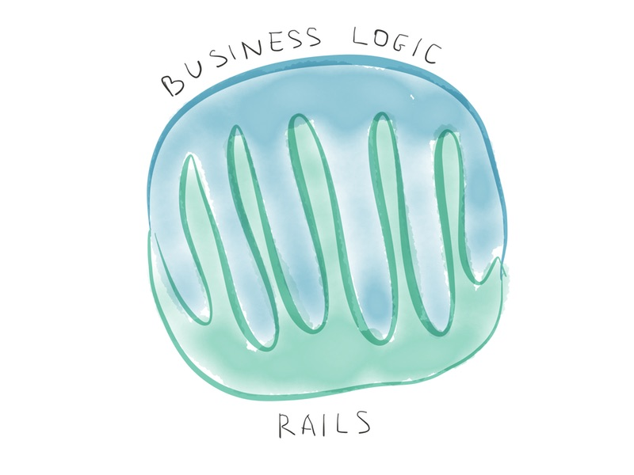
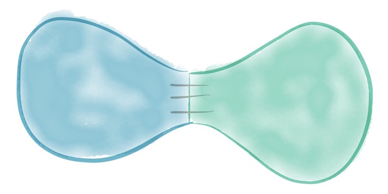

footer: Mickey Chen
slidenumbers: true

# Fly Like Phoenix
## An Intro to Phoenix Framework

---

# Backgrounds

---

## Author

### Chris McCord

 

---

## Websocket First

- 廣義 MVC framework
- [The Road to 2 Million Websocket Connection](https://www.phoenixframework.org/blog/the-road-to-2-million-websocket-connections)

---

## How Phoenix Matchup

| Framework | Throughput (req/s) | Latency (ms) | Consistency (σ ms) |
| --------- | ---------------- | ----------------| ------------ |
| Gin | 51483.20 | 1.94 | 0.63 |
| **Phoenix** | 43063.45 | 2.82 | 7.46 |
| Express Cluster | 27669.46 | 3.73 | 2.12 |
| Martini | 14798.46 | 6.81 | 10.34 |
| Sinatra | 9182.86 | 6.55 | 3.03 |
| Express | 9965.56 | 10.07 | 0.95 |
| Rails | 3274.81 | 17.25 | 6.88 |
| Plug (1) | 54948.14 | 3.83 | 12.40 |
| Play (2) | 63256.20 | 1.62 | 2.96 |

---

## What is Included

| Usage | Package |
| :--- | ---: |
| Runtime | OTP |
| Web Server | Plug (_NOT_ A9a Plug) |
| Data Mapping | Ecto |
| Web Socket | Phoenix PubSub |
| Assets Compiling | Webpack |
| WS Client | Phoenix.js |
| Server Side SPA | Phoenix LiveView |

---

# Phoenix Internals

---

## File & Folder Structure

- Domain Driven Design
- Web vs Business Logic

 

---

## Request Lifecycle

- 1 Request = 1 Process
- 1 WS = 1 Process

^ Show in observer

---

[.build-lists: true]

### Continuing...

1. Cowboy Accepts Connection
2. Plug (Conn Struct)
3. Phoenix Endpoint
4. Phoenix Router
5. Phoenix Controller
6. Phoenix View + Template

---

### 7. Profit!!!

---

## Plug

- Request -> `%Conn{}`
- `plug :my_plug_function`
- `plug CustomPlugModule`

---

## Phoenix Endpoint is Just a Plug Pipeline

---

## Phoenix Router

- `pipeline/2` & `pipe_through/1`
- `scope/4`
- `resources/4`

---

## Phoenix Controller, View & Template

---

## Phoenix PubSub

- Web Socket
- Phoenix Presence for multi-node presence tracking

---

## Ecto

- Repository Pattern
- Schema
- Changeset
- Query
- Repo

^
Flexible Data layer
Easily composed
SQL-like syntax

---

## Phoenix LiveView

---

做不完啊啊啊啊啊
